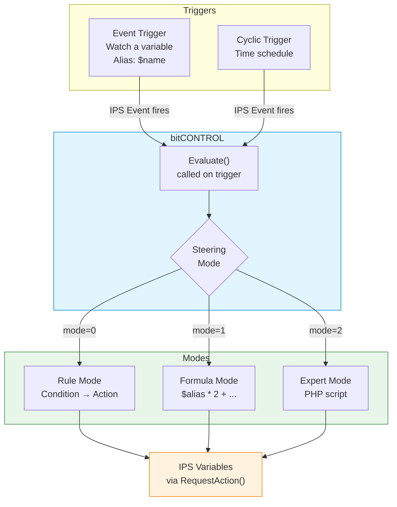
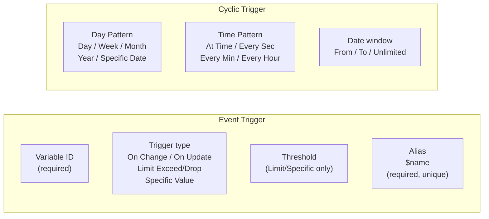
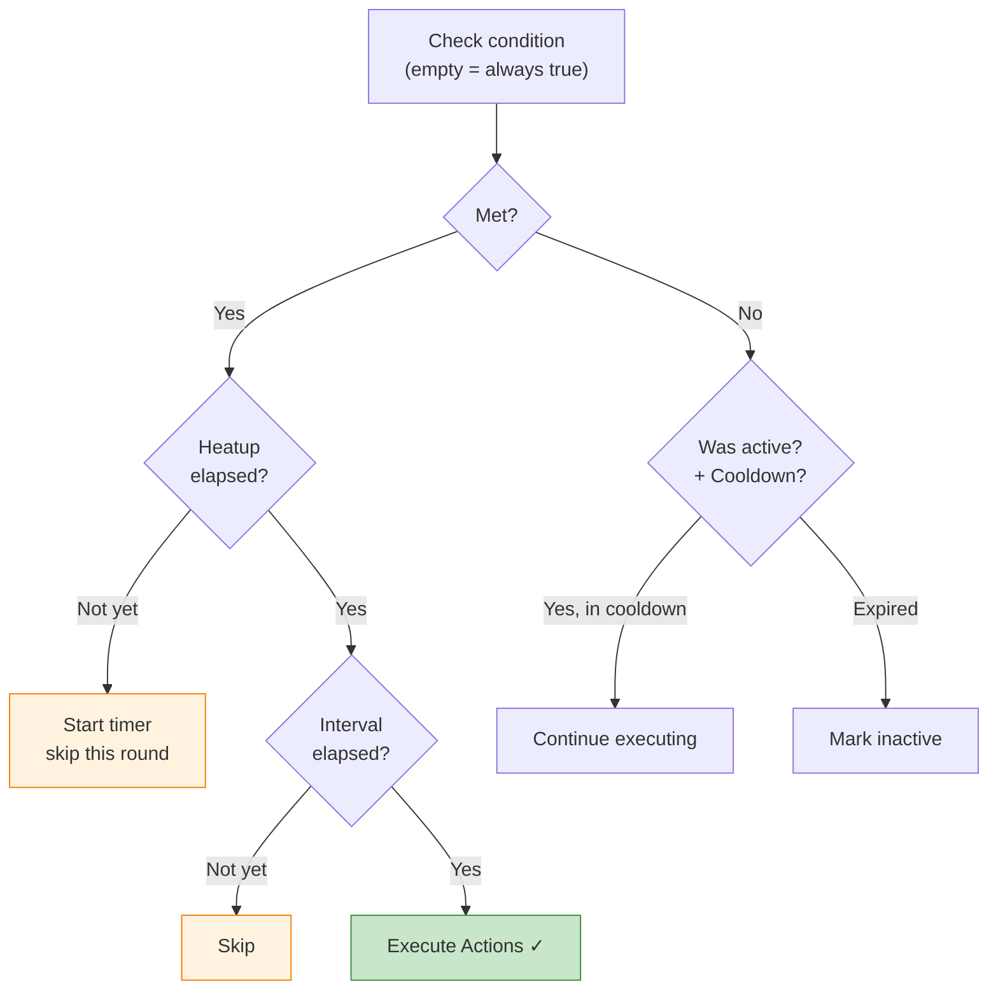
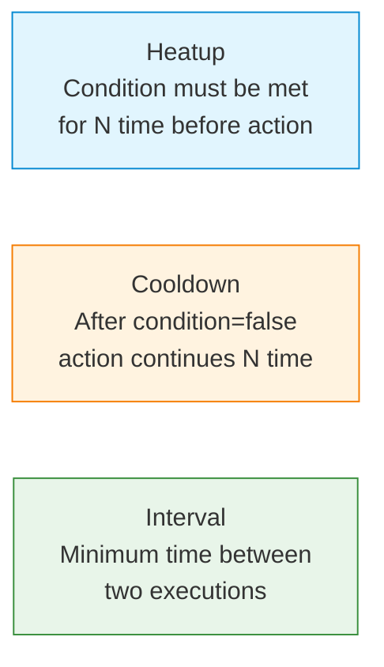
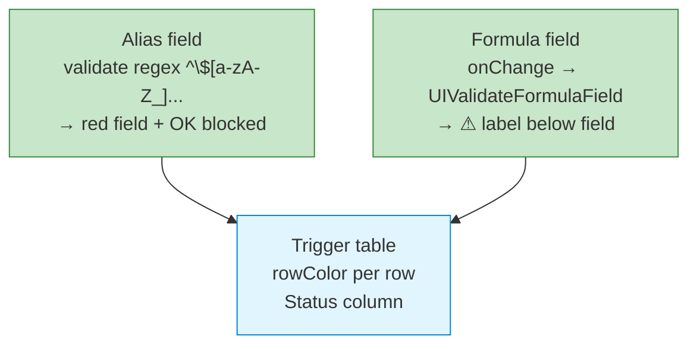

# bitDEVICE

**IP-Symcon Module Library** by [bition](https://dev.azure.com/bitI0N/bitHOME) — a collection of Device Modules for IP-Symcon that extend the platform with intelligent automation logic.

[](https://dev.azure.com/bitI0N/bitHOME/_build/latest?definitionId=bitDEVICE)

---

## Modules

| Module | Type | Description |
|--------|------|-------------|
| [**bitCONTROL**](#bitcontrol) | Device (3) | Dynamic output variable controller — Rule, Formula, Expert modes |

---

## bitCONTROL

bitCONTROL controls IP-Symcon output variables dynamically. It reacts to configurable triggers and executes actions based on one of three steering modes.

### How it works



### Triggers

Two trigger types create IPS child events under the instance:



The **alias** (`$name`) makes the current variable value available as a PHP variable in Formula and Expert mode.

### Steering Modes

#### Rule Mode

Rules are evaluated in order. Each rule defines a condition, action(s) and optional timing:



#### Formula Mode

Mathematical expressions evaluated against the alias map:

```php
$outside * 2           // multiply trigger value
round($outside, 1)     // round to 1 decimal
clamp(0, $outside, 30) // clamp between 0 and 30
$counter + 1           // increment: reads current output value before writing
```

**Allowed functions:** `min()`, `max()`, `abs()`, `round()`, `floor()`, `ceil()`, `clamp()`, `avg()`, `sum()`

Each formula row supports its own conditions, heatup, cooldown and interval — identical to rules.

#### Expert Mode

Free PHP script with full access to trigger aliases and output variables:

```php
// $outside is available as PHP variable (from Event Trigger alias)
$server = $outside * 1.5;

if ($outside > 30) {
    $cooling = true;
    $target  = 20;
} else {
    $cooling = false;
    $target  = 22;
}
// $server, $cooling, $target written to output variables via RequestAction()
```

### Timing Parameters

All modes support per-rule/formula timing with selectable units (seconds / minutes / hours):



### Evaluation Modes

Available for both Rule and Formula modes:

| Mode | Behavior |
|------|----------|
| **First matching wins** | Execute first passing rule/formula, stop |
| **Execute all matching** | Execute every passing rule/formula |

When using **First matching wins**, three skip flags (Heatup / Cooldown / Interval) control whether a skipped rule stops evaluation or allows the next rule to be tried.

### Inline Validation



- **Green row** — configuration valid
- **Orange row** — no variable selected
- **Red row** — alias error or formula error
- **Grey row** — inactive

### Status Codes

| Code | Meaning |
|------|---------|
| 102 | Module active |
| 104 | Module inactive |
| 200 | No valid triggers defined |
| 201 | Invalid or duplicate alias |
| 202 | Formula syntax error |
| 203 | Script syntax error |
| 204 | Referenced variable not found |

---

## Repository Structure

```
bitDEVICE/
├── library.json          — Library metadata (ID, author, version)
├── bitCONTROL/
│   ├── module.json       — Module metadata (Prefix: BCC, Type: 3)
│   ├── module.php        — Main module class (IPSModuleStrict)
│   ├── form.json         — Static base form (status codes only)
│   ├── locale.json       — English → German translations
│   └── libs/
│       ├── FormBuilder.php      — Dynamic form generation
│       ├── TriggerManager.php   — IPS event management
│       ├── AliasValidator.php   — Alias format & uniqueness validation
│       ├── FormulaEvaluator.php — Math expression parser & evaluator
│       ├── ExpertEvaluator.php  — PHP script sandbox execution
│       └── RuleEvaluator.php    — Rule evaluation with state management
└── .wiki/                — Developer documentation
```

---

## Installation

1. Clone or copy the `bitCONTROL` directory into your IP-Symcon modules folder
2. Reload the module list in IP-Symcon (Module Control → Reload)
3. Create a new instance of type **bitCONTROL**
4. Configure triggers, select a steering mode, define rules / formulas / script
5. Activate the instance

> **Note:** New instances are **inactive by default**. Activate explicitly once configuration is complete.

---

## Further Documentation

| Document | Content |
|----------|---------|
| [bitCONTROL Overview](.wiki/bitcontrol/README.md) | Architecture, modes, timing, validation |
| [Trigger Configuration](.wiki/bitcontrol/trigger/AGENTS.md) | Event & cyclic triggers, alias system, validation |
| [Rule Mode](.wiki/bitcontrol/rules/AGENTS.md) | Rules, conditions, heatup/cooldown/interval, state |
| [Formula Mode](.wiki/bitcontrol/formula/AGENTS.md) | Formula syntax, allowed functions, output aliases |
| [Expert Mode](.wiki/bitcontrol/expert/AGENTS.md) | PHP sandbox, alias map, output variable assignment |
| [IP-Symcon Form API](.wiki/symcon/form-api/README.md) | Form elements, List popups, RowLayout, translations |
| [IP-Symcon Events](.wiki/symcon/events/README.md) | IPS_SetEventCyclic API reference (Symcon 9+) |
| [Module Structure](.wiki/symcon/module-structure/README.md) | IPSModuleStrict, lifecycle, properties vs attributes |
